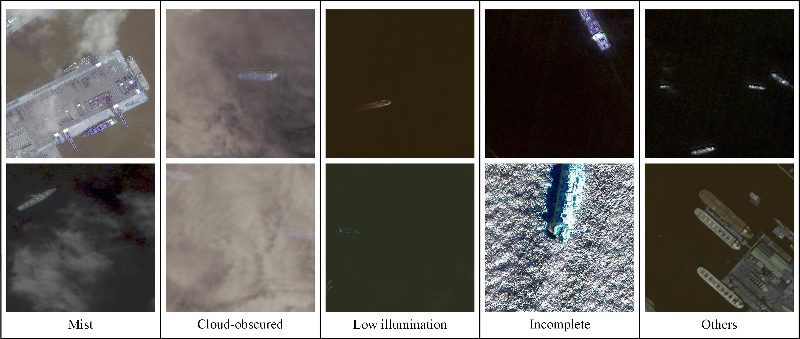
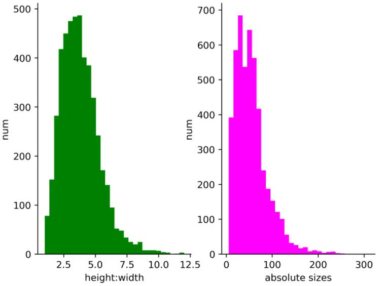
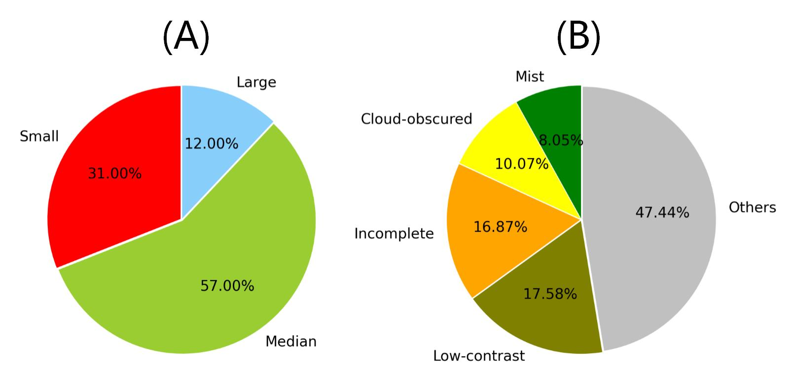

**A complex spaceborne optical ship dataset (CBSD)**

Automated ship detection plays an increasingly important role in maritime surveillance, monitoring, and traffic supervision. It can help to control illegal fishing and cargo transportation. A new Complex Background Ship Dataset (abbreviated as *CBSD*) is proposed here.  

After cropping and selecting, we have collected 1658 high-resolution satellite images including about 4826 ships. Some images from the collected dataset are shown in Fig.1

Moreover, to more concretely describe the complexity of the images, we divide the images into different scenes roughly according to the background of the ship.

We mainly divide the scene into five aspects: the mist scenes, the cloud-obscured scenes, the low contrast scenes, and other scenes. In addition, we classify the incomplete ship in the scene as incomplete scenes.

There are often different cloud interference in mist and cloud-obscured scenes. Low contrast scenes are images with a dark background and images with low illuminations. For incomplete ships, it is caused by cropping or satellite imaging limitations.

We use the absolute size ($as_i$) to measure the size of the ship $i$: $as_i = \sqrt{h_i\times w_i}$, where $h_i$ and $w_i$ is the heigh and width of the ship $i$. The statistical results of aspect ratio and absolute scale are recorded in Fig.2

The ratio of ships with different scales and the ratio of scenes with different complex backgrounds are recorded in Fig. 3

We will be uploading data sets shortly !
